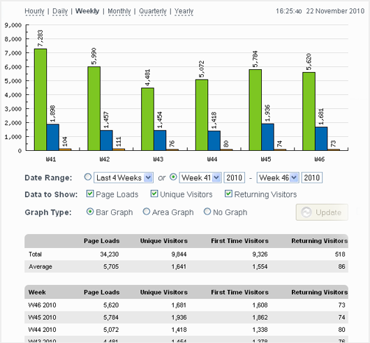
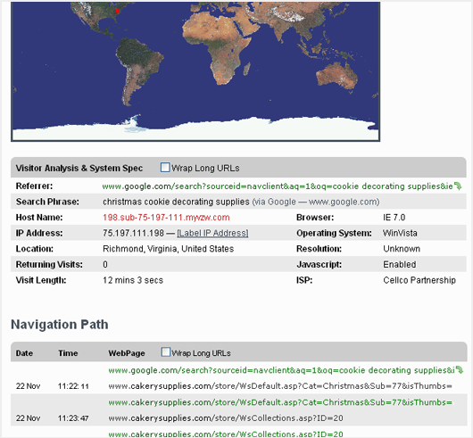


.. include:: ../Includes.txt

============
Introduction
============

ext:ns_statcounter
===================

.. _What-does-it-do:

What does it do?
================

StatCounter is a free web traffic analysis service, which provides summary stats on all your traffic and a detailed analysis of your last 500 page views. This limit can be increased by subscribing to their paid service.

The StatCounter TYPO3 Extension brings you all the powerful StatCounter features to your TYPO3 site. `http://statcounter.com/features/ <http://statcounter.com/features/>`_

.. _Screen-shots:

Screen Shots
================

